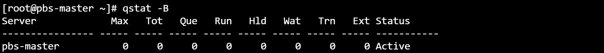

# OpenPBS

## on master
### Step 1: install packages
```bash
# clone the openpbs repo
git clone https://github.com/openpbs/openpbs.git

# install deveopment tools
yum groupinstall "Development Tools" -y

```


### Step 2: install OpenPBS
```bash
# rename the folder the folder
mv ./openpbs/ ./openpbs-23.06.06

# create a tar file 
tar -cvf /root/rpmbuild/SOURCES/openpbs-23.06.06.tar.gz openpbs-23.06.06/ 

# navigate to the folder
cd openpbs-23.06.06/

# build the rpm file
rpmbuild -ba openpbs.spec

# to extract the dependencies list(Optional)
rpmbuild -ba openpbs.spec
cat dependencies_list | sed -n '4,20p' | awk '{print $1}'

# install the dependencies
yum install -y libtool-ltdl-devel hwloc-devel libX11-devel libXt-devel libedit-devel libical-devel ncurses-devel postgresql-devel postgresql-contrib python3-devel tcl-devel tk-devel zlib-devel expat-devel openssl-devel libXext libXft gcc hwloc-devel;

# re-run the command after installing dependencies
rpmbuild -ba openpbs.spec

# navigate to the directory 
cd /root/rpmbuild/RPMS/x86_64

# install opebpbs-server
yum install openbps-server-23.06

```


### Step 3: configure pbs.conf
```bash
# change ownership of the file 
chmod 4755 /opt/pbs/sbin/pbs_iff /opt/pbs/sbin/pbs_rcp

# to start the services
systemctl start pbs
systemctl status pbs
systemctl enable pbs

# to check the status of the service
/etc/init.d/pbs status

# to source the environment
. /etc/profile.d/pbs.sh

# how to check journalctl for specific service(Optional)
journalctl -f -u pbs

```





## on node 1

### Step 4: 
```bash
# clone git repository and install development tools
git clone https://github.com/openpbs/openpbs.git;
yum groupinstall "Development Tools" -y;
yum groupinstall autoconf automake libtool -y;

# run autogen.sh
cd openpbs;
./autogen.sh

# install dependencies
yum install -y libtool-ltdl-devel hwloc-devel libX11-devel libXt-devel libedit-devel libical-devel ncurses-devel postgresql-devel postgresql-contrib python3-devel tcl-devel tk-devel zlib-devel expat-devel openssl-devel libXext libXft gcc hwloc-devel openssl ;

# run ./configure command (make sure /opt/pbs folder is empty)
./configure --prefix=/opt/pbs/

# run make install command
make install


# make the pbs.sh executeable
chmod -x /opt/pbs/etc/pbs.sh


# source the command
. /opt/pbs/etc/pbs.sh

# just in case export command do not work, export it mannually
export PATH=${PATH}:/opt/pbs/bin

# copy the /etc/pbs.conf file from master to node1(run on master)
scp /etc/pbs.conf root@[ip]:/etc/pbs.conf

# create a nfs server on master and mount this on node2
yum install -y nfs-utils
systemctl start nfs-server rpcbind
systemctl enable nfs-server rpcbind
echo '/root/rpmbuild/RPMS/x86_64/ 10.10.10.0/24(rw,sync,no_root_squash)' >> /etc/exports
exportfs -r

# on node2 
yum install -y nfs-utils
showmount -e 10.10.10.158
mount -t nfs 10.10.10.158:/home /home 


```


## Day 3
```bash
# to view conigurating in files
qmgr p s


```


