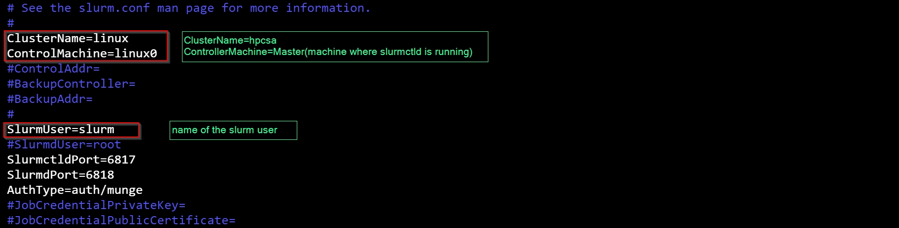
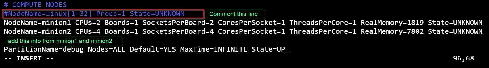

# How to config NFS Server

```bash
Pre-requisites:
disable selinux
disable firewall
change hostname if required
```


### Step 1: first install the package
```bash
yum install -y nfs-utils
```


### Step 2: start the service
```bash
systemctl start nfs-server rpcbind
systemctl enable nfs-server rpcbind
```


### Step 3: select directory to host
```bash
chmod 777 /home/
```


### Step 4: make entry of the shared file in the /etc/exports
```bash
/home 10.10.10.0/24(rw,sync,no_root_squash)
# dont give space between ip(permissions), this will lead to read only file system error
```


### Step 5: export the shared directories using given command
```bash
exportfs -r
# exportfs -v : dispalys a list of shared file and export options on server
# exportfs -a : exports all directories listed in /etc/exports
# exportfs -u : unexport one or more directories
# exportfs -r : re-export all directories after modifying /etc/exports
```


### Step 6: configure the firewall
```bash
firewall-cmd --permanent --add-service mountd
firewall-cmd --permanent --add-service rpc-bind
firewall-cmd --permanent --add-service nfs
firewall-cmd --reload
```

---
---
# Configure the Clients
### Step 7: install package on client 
```bash
yum install -y nfs-utils            
```


### Step 8: check if shared file or directory is visible or not
```bash
showmount -e 10.10.10.158
```


### Step 9: mount the shared directory
```bash
mount -t nfs 10.10.10.158:/home /home
# to check if given directory is mounted or not
mount | grep nfs 
# to check if given directory is mounted or not
df -hT
```


### Step 10: how to enable automount
```bash
echo "10.10.10.158:/home /home   nfs nosuid,rw,sync,hard,intr    0   0" >> vi /etc/fstab
```
### Step 10: how to unmount the shared directory
```bash
umount /mnt/sharedFolder
```

---

[reference for slurm installation](https://github.com/Artlands/Install-Slurm)

# How to install slurm
### Step 1: install packages
```bash
yum install epel-release munge munge-libs munge-devel -y;
```

### Step 2: generate the munge key 
```bash
/usr/sbin/create-munge-key -r;
```


### Step 3: copy the munge key on both minions 
```bash
scp /etc/munge/munge.key root@minion1:/etc/munge;
scp /etc/munge/munge.key root@minion2:/etc/munge;
```

### Step 4: start the munge services 
```bash
chown munge:munge /etc/munge/munge.key;
systemctl start munge.service;systemctl enable munge.service;
ssh root@minion1 'chown munge:munge /etc/munge/munge.key;' 
ssh root@minion2 'systemctl start munge.service;systemctl enable munge.service;' 
ssh root@minion2 'chown munge:munge /etc/munge/munge.key;' 
ssh root@minion1 'systemctl start munge.service;systemctl enable munge.service;' 
```
```
[Error]:

if munge key is not generated or taking too much time to create then we have to install random number generator for more information please follow the link given below

to solve this issue:
yum install -y rngd;
systemctl start rngd;systemctl enable rngd;
```
[random number generator](https://stackoverflow.com/questions/4819359/dev-random-extremely-slow) 


### Step 5: download slurm tar file from source 
```bash
wget https://download.schedmd.com/slurm/slurm-20.11.9.tar.bz2
```

### Step 6: build the package 
> install packages on all nodes, but run rpmbuild only on master
```bash
yum install -y rpm-build;
rpmbuild -ta slurm-20.11.9.tar.bz2
# to install the dependencies
yum install pam-devel python3 readline-devel perl-ExtUtils-MakeMaker gcc mysql-devel -y
# now try to build the package again
rpmbuild -ta slurm-20.11.9.tar.bz2
```


### Step 7: creating user for slurm   
> create this user on all three nodes, masters as well as minions
```bash
# variable export 
export SLURMUSER=900;
# add group
groupadd -g $SLURMUSER slurm;
useradd -m -c "SLURM workload manager" -d /var/lib/slurm -u $SLURMUSER -g slurm -s /bin/bash slurm;
cat /etc/passwd;
```

### Step 8: now install the local packages   
> install local packages present in the path /root/rpmbuild/RPMS/x86_64/
```bash
cd /root/rpmbuild/RPMS/x86_64/
yum --nogpgcheck localinstall * -y
# to confirm if packages has been installed or not
rpm -qa | grep slurm | wc -l
# make directory on shared home folder of master
mkdir /home/rpms;
# copy all the packages from /root/rpmbuild/RPMS/x86_64/ to /home/rpms
cp * /home/rpms/;
# on minion1
cd /home/rpms;
yum --nogpgcheck localinstall * -y
# to confirm if packages has been installed or not
rpm -qa | grep slurm | wc -l
# on minion2
cd /home/rpms;
yum --nogpgcheck localinstall * -y
# to confirm if packages has been installed or not
rpm -qa | grep slurm | wc -l
```


### Step 9: create the directories for the slurm configuration   
> create folder where master has to store log files and give permission of those directories to slurm  
> partitions are created according to the group of node types(CPU Nodes, HM nodes,)
```bash
mkdir /var/spool/slurm
chown slurm:slurm /var/spool/slurm
chmod 755 /var/spool/slurm
mkdir /var/log/slurm
chown slurm:slurm /var/log/slurm
touch /var/log/slurm_jobacct.log /var/log/slurm_jobcomp.log
chown slurm:slurm /var/log/slurm_jobacct.log /var/log/slurm_jobcomp.log


# copying the configuration example file and creating new file
cp /etc/slurm/slurm.conf.example /etc/slurm/slurm.conf
vi /etc/slurm/slurm.conf
    edit : clusterName=hpcsa
    edit : clusterMachine=master
    edit : slurmUser=slurm
    edit : #COMPUTE NODES
            #NodeName=node[1-2] Procs=1 State=UNKOWN
            NodeName=minion1 CPUs=2 Boards=1 SocketsPerBoard=2 CoresPerSocket=1 ThreadsPerCore=1 RealMemory=1819 State=UNKOWN 
            NodeName=minion2 CPUs=4 Boards=1 SocketsPerBoard=4 CoresPerSocket=1 ThreadsPerCore=1 RealMemory=7802 State=UNKOWN
            ParitionName=standard NODES=ALL Default=YES MaxTime=INFINITE State=UP
            :wq # save and exit


# run on client and get the satus of the node and paste this information in the configuration file
slurmd -C

chown slurm:slurm /etc/slurm/slurm.conf
# copy this config file to all the nodes
scp /etc/slurm/slurm.conf root@minion1:/etc/slurm/
scp /etc/slurm/slurm.conf root@minion2:/etc/slurm/

# start slurmctld service on master
systemctl start slurmctld;systemctl enable slurmctld;
# start slurmd service on master
systemctl start slurmd;systemctl enable slurmd;
```






# Day 2:
### Step 10: start the services
```bash
# disable the selinux
setenforce 0;
sed -i 's/SELINUX=.*$/SELINUX=disabled/g' /etc/selinux/config
systemctl stop firewalld;systemctl disable firewalld;
# restarting the services
systemctl start munge slurmd;
systemctl status munge slurmd;

# to troubleshoot the reason why slurmd is not starting
slurmd -Dvv
# we need to create required folder 
mkdir -p /var/spool/slurm/d
systemctl restart slurmd;
systemctl status slurmd;

# slurmctld runs on master
systemctl restart slurmctld;systemctl status slurmctld; 
# slurmd runs on minions 
systemctl restart slurmd;systemctl status slurmd; 

```


### Step 11: submitting the job
```bash
# taking shell of a minion
srun -w minion1 --pty /bin/bash

# to submit a job to client in interactive mode
srun -N1 --pty /bin/bash

# how to set state of a node to down
scontrol update node=minion1 state=down reason=main

# how to set state of a node to resume
scontrol update node=minion1 state=resume reason=main


# how to submit a script using sbatch

#!/bin/bash
# Account:
#SBATCH --account=account_name
#
# Job name:
#SBATCH --job-name=test
#
# Partition:
#SBATCH --partition=standard
#
# Request one node:
#SBATCH --nodes=2
#
# Specify one task:
#SBATCH --ntasks-per-node=1
#
# Number of processors for single task needed for use case (example):
#SBATCH --cpus-per-task=2
#
# Wall clock limit:
#SBATCH --time=00:05:00
#

#SBATCH --out=output-%j.out

# how to see details of the running job
scontrol show job [id]
# to get job id
squeue


```


### Step 12: slurm accounts
```bash
# to see accounts
sshare

# to create reservation 
scontrol create reservation starttime= duration= user=root nodes=all

# to check reservations
scontrol show res

```


